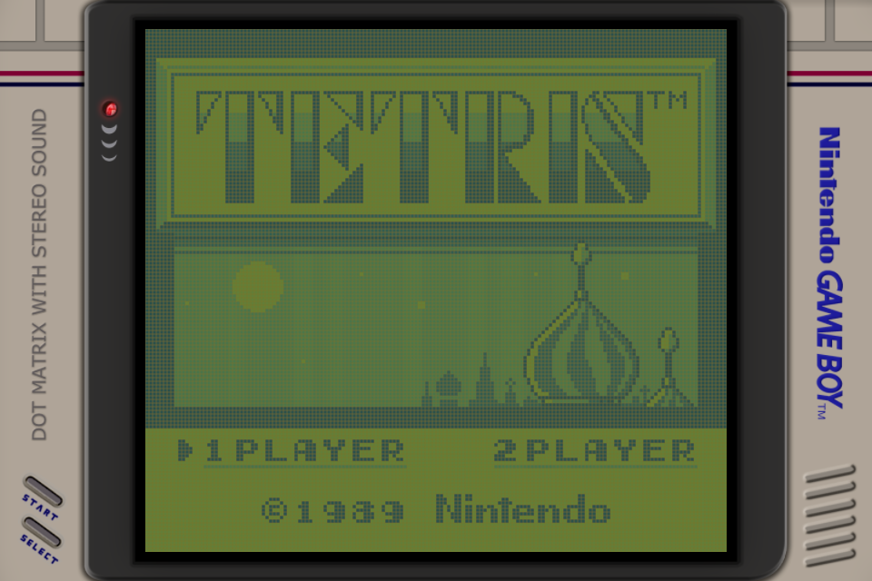
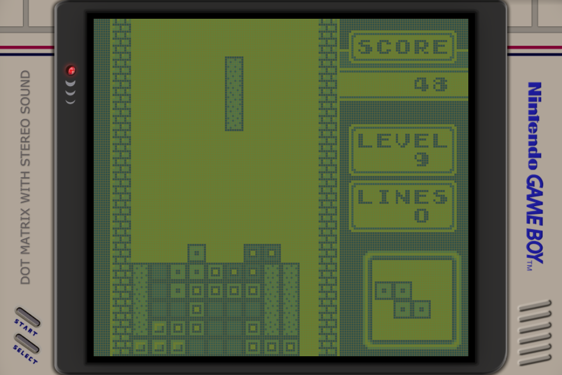
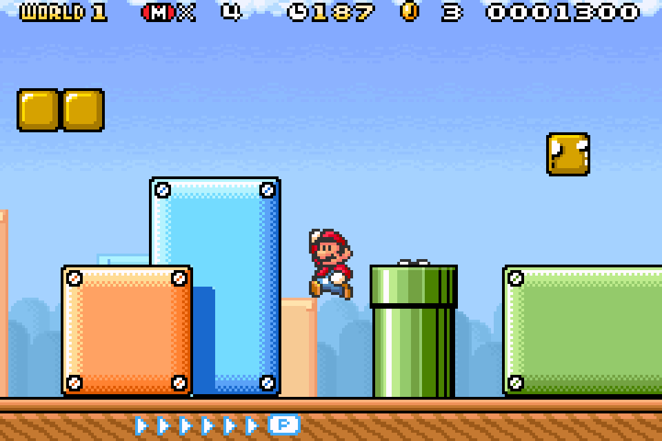
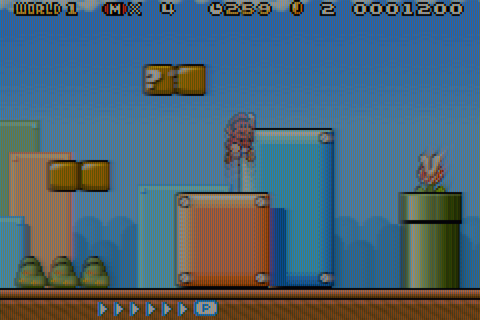

# Retro Display Lab

[English](README.md) | [繁體中文](README.zh-tw.md) | **简体中文**

给 RetroArch 用的掌机 LCD Shader，从物理模型到数据出处都写清楚。

大多数怀旧屏幕 Shader 从颜色开始，也在颜色结束。这样能让截图看起来有些相似，却重建不了屏幕本身：方块下落时拖过后方行线的残影、不同灰阶转换各自的速度、被动矩阵某一条线对相邻像素驱动的影响，或静态画面消失后留下的微弱电气记忆。

Retro Display Lab 把这些行为做成有因果关系的面板模拟。DMG-01 从被动矩阵驱动一路计算到 STN 指向矢动力学、行列串扰、慢速离子状态与反射式像素结构；AGS-101 则从测量色彩出发，接上 TFT gray-to-gray 响应、交替驱动与 residual DC、scan／latch／optical timing，以及 BGR 子像素开口。这些并不是叠在调色板上的装饰性拖影；画面来自随原始面板驱动持续演化的状态。

## 这个模型到底在做什么

Color Tint 只能改颜色，固定混合前几帧也只是加上一种通用模糊。这里保存的是每个像素真正需要的电气与光学状态：

- 输入色码会先变成面板驱动与光学目标，最后才转换成现代屏幕的颜色；
- 响应沿着完整的画面历史持续演化，加深、褪去与各种 gray-to-gray 转换都可以走不同路径；
- 被动矩阵的 loading／crosstalk 和 STN 响应分开求解；TFT 的驱动极性与 residual DC 也有各自的持久状态；
- 扫描位置、latch 时间、光学 onset、像素开口、反射层阴影与 BGR 子像素，都是模型本身的一部分，而不是最后贴上去的材质；
- 原始面板的物理，和针对现代目标屏幕做的补偿，是两件分开处理的事。

因此目前两套 normal preset 从头到尾都使用物理模型。不过这并不代表每个常数都是从全新原机直接测得的；找不到原始驱动波形或响应矩阵时，模型会采用受文献约束的重建值，并明确说明这一点。

把成果称作“**物理启发、测量约束的重建**”是有意保守的说法。如果找不到原面板的驱动波形或响应矩阵，就把文献约束、候选值和不确定性一起公开，而不是把推导出来的数字包装成实测值。细节见[方法论](docs/methodology.md)、[引用规范](docs/reference-policy.md)和[完整 Reference 索引](REFERENCES.md)。

## 可下载模型：Nintendo DMG-01

[`models/nintendo-dmg-01`](models/nintendo-dmg-01) 重建的是初代 Game Boy 那块反射式被动矩阵 STN LCD：

- 游戏可以指定的四个灰阶，加上 LCD 未驱动时那层独立的光学底色；
- 由 Game Boy 精确扫描时序驱动的 mobile surrogate，依次重建 RMS drive、STN 指向矢动力学与反射光学响应；
- 行列电极 loading、局部被动矩阵 crosstalk，以及能保住相邻逻辑色阶的有界 common-mode 修正；
- 非对称灰阶转换，以及受同时代 STN 测量约束的逐像素离子残影；
- 依据公开 DMG 近拍资料建立的矩形像素开口与反射层阴影；
- Reference、重拖影、老化个体，以及加速实验用的 preset。

哪一份资料对应到哪一段代码、有哪些限制，都写在 [DMG-01 Evidence Map](models/nintendo-dmg-01/REFERENCES.md) 里。目前的机器可读重建决策与后续实现工作，分别记录在 [`reconstruction-v1.json`](models/nintendo-dmg-01/data/reconstruction-v1.json) 和 [implementation to-do](models/nintendo-dmg-01/IMPLEMENTATION-TODO.md)。

### 代表画面

<table>
  <tr><th>标题首页 — 串扰</th><th>方块下落 — 拖影</th></tr>
  <tr>
    <td></td>
    <td></td>
  </tr>
</table>

两张都是在同一台 KPA、同一个 Gambatte core、同一份俄罗斯方块 ROM、当前的 DMG shader、同样的 viewport、显示状态与 Game Boy 遮罩下拍的 960×640 framebuffer 截图。标题首页的大面积高对比图形能看出行列串扰；游戏画面则抓到直条方块从较高处落向已经堆起的盘面，垂直尾巴会把时间响应直接显示出来。静态图仍然只能留下整段衰减中的一个瞬间。

## 可下载模型：Nintendo GBA SP AGS-101

<table>
  <tr><th>关闭 Shader — 模拟器原始输出</th><th>开启 Shader — AGS-101 物理模型</th></tr>
  <tr>
    <td></td>
    <td></td>
  </tr>
</table>

Preset 名称仍然是
[`physics-seed-v1`](models/nintendo-ags-101/presets/physics-seed-v1.slangp)，
不过原先规划的五个物理 workstream 现在都已经实现。两个 pass 会一起处理：

- 从固定版本的 HCS AGS-101 测量记录，可复现地推导 32 阶 EOTF、原生色彩矩阵与黑白锚点；
- 连续的逐子像素 TFT gray-to-gray 状态，以及能直接接收未来实测转换数据的 deterministic table 路径；
- 交替驱动极性，以及使用已发表 adsorption／desorption kinetics 的慢速 residual-DC 残影；
- 精确的 GBA row timing，拆成 row start、电气 latch 与 optical onset，跨 frame 的事件仍保持因果关系；
- 解析式 BGR 像素开口，最后接上测量得到的 native-to-host 色彩转换。

目前仍没有该 AGS-101 的完整 gray-to-gray matrix 或主板时序 trace，因此 default 使用文档中列明的解析模型与同时代文献候选值；measured-table 与诊断路径则留给更好的证据。中性 sRGB adapter 也仍作为回归基准。完整分类与限制见 [AGS-101 Evidence Map](models/nintendo-ags-101/REFERENCES.md)。

游戏画面只是用来说明 Shader 的行为。俄罗斯方块、马力欧、Nintendo 商标和游戏内容都归各自的权利人所有。

## 下载

- 稳定版 v0.4.0：[固定 tag ZIP](https://github.com/JohnnySun/retro-display-lab/archive/refs/tags/v0.4.0.zip)
- 发布说明：[GitHub Releases](https://github.com/JohnnySun/retro-display-lab/releases)
- 最新开发版：[`main` 的 ZIP](https://github.com/JohnnySun/retro-display-lab/archive/refs/heads/main.zip)
- Git：`git clone https://github.com/JohnnySun/retro-display-lab.git`

## 安装到 RetroArch

1. 把项目解压或 clone 到 `RetroArch/shaders/retro-display-lab`。
2. 切到 Vulkan video driver，target profile 有要求的话就打开整数缩放。
3. 关掉模拟器 core 自带的 frame mixing，否则时间响应会被模拟两遍。
4. 加载跟你设备相符的那个 target profile 下面的 `.slangp`。

我手上测过的 KONKR GT78-VN，对应的是这个：

```text
retro-display-lab/targets/konkr-gt78-vn/960x640-srgb-neutral/presets/dmg01-reference-v1.slangp
```

同一台设备的 GBA 内容请加载：

```text
retro-display-lab/targets/konkr-gt78-vn/960x640-srgb-neutral/presets/ags101-physics-seed-v1.slangp
```

DMG profile 会在面板上放一个 640×576 的 viewport，正好是 4 倍整数缩放；AGS-101 profile 则把 240×160 原始画面以 4 倍填满同一块 960×640 面板。这个 target 的显示状态是“**sRGB-neutral、未测量**”，跟仪器校准过的 sRGB 不是一回事。换成别的面板，请从 model preset 出发，自己建一份 target profile。完整步骤见[安装说明](docs/installation.md)。

## 复现与验证

```sh
npm test
```

检查范围包括 Shader／preset 结构、生成文件的可复现性、Reference ID、色阶顺序、
STN surrogate 与 crosstalk gate、TFT gray-to-gray lookup／fallback、residual-DC
积分、scan event 因果性、target scale、HCS 色彩向量，以及未测量显示状态有没有
被如实披露。要提 PR 的话，请照[引用规范](docs/reference-policy.md)和
[贡献指南](CONTRIBUTING.md)来。学术或技术用途请引用
[`CITATION.cff`](CITATION.cff)，并附上实际使用机制所对应的机型 Reference。

## 许可

项目的原创代码和文档采用 Apache-2.0。第三方来源各自保持原本的条款：BGB 图片、商业 ROM，以及未获许可的 HCS Shader／数据文件，这里都不会再分发。
