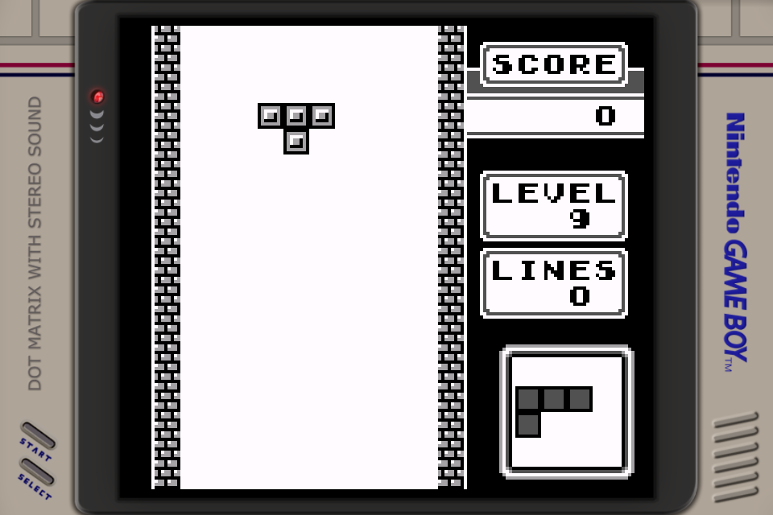
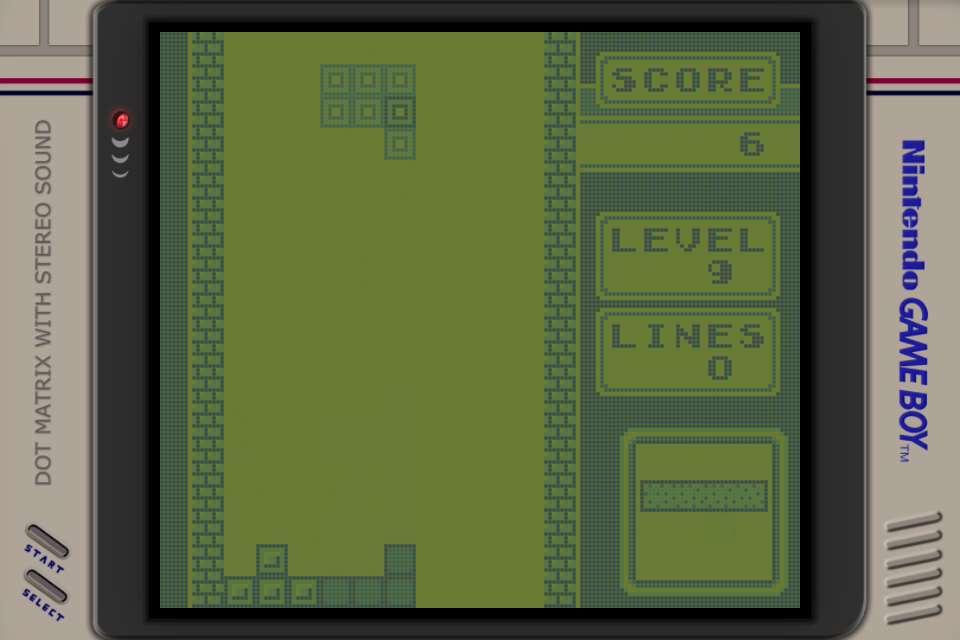

# Retro Display Lab

[English](README.md) | **繁體中文** | [简体中文](README.zh-cn.md)

面向 RetroArch、以研究可追溯性為核心的物理啟發式掌機螢幕 Shader。

Retro Display Lab 將老式 LCD 視為一個隨時間變化的光學系統，而不是替畫面
套上一層色調。模型可分別模擬光學色階、像素開口、矩陣／TFT 結構、方向相依
響應、灰階轉換、串擾與長時間殘像。每一項重要機制與參數都必須連回實際量測、
一手技術文獻，或清楚標示的實驗假設。

## 方法上的差異

Color Tint 只能改變顏色，無法重建與動態內容有關的螢幕缺陷。固定混合前幾幀
雖然可以近似拖影，卻會任意截斷歷史，並讓所有灰階轉換呈現相同行為。本專案
改用因果、逐像素的狀態模型：

- 快速與慢速光學響應會累積完整的畫面歷史；
- 加深與褪去，或不同 gray-to-gray 轉換，可以有不同速度；
- 由曝光時間累積的離子／殘留直流狀態，使用獨立的長時間尺度；
- 點陣開口、反射層陰影、行列串擾與 TFT 結構和色彩分開建模；
- 原始螢幕模型與現代目標面板的補償設定彼此分離。

我們將成果描述為「**物理啟發、測量約束的重建**」。若找不到原面板的驅動
波形或響應矩陣，就公開文獻約束、候選值與不確定性，不把推導值冒充實測值。
詳見[方法論](docs/methodology.md)、[引用規範](docs/reference-policy.md)與
[完整 Reference 索引](REFERENCES.md)。

## 可下載模型：Nintendo DMG-01

[`models/nintendo-dmg-01`](models/nintendo-dmg-01) 重建初代 Game Boy 的
反射式被動矩陣 STN LCD：

- 四個遊戲可指定灰階，以及獨立的 LCD 未驅動光學底色；
- 非對稱短期響應、結構慢尾，以及受 1994 年 STN 實驗約束的逐像素離子殘像；
- 低強度行／列串擾；
- 依據公開 DMG 近拍資料建立的矩形像素開口與反射層陰影；
- Reference、重拖影、老化個體與加速實驗 preset。

每一筆資料如何對應到程式碼、參數與限制，請見
[DMG-01 Evidence Map](models/nintendo-dmg-01/REFERENCES.md)。

### 效果對比

<table>
  <tr><th>關閉 Shader — Gambatte 原始輸出</th><th>開啟 Shader — DMG-01 Reference v1</th></tr>
  <tr>
    <td></td>
    <td></td>
  </tr>
</table>

兩張圖均為同一台 KPA、Gambatte core、俄羅斯方塊 ROM、viewport 與顯示狀態下
的 960×640 framebuffer 截圖，但不是同一個模擬幀。靜態圖無法完整呈現拖影衰減。

## AGS-101 研究原型

<table>
  <tr><th>關閉 Shader — 模擬器原始輸出</th><th>開啟 Shader — AGS-101 物理原型</th></tr>
  <tr>
    <td></td>
    <td></td>
  </tr>
</table>

原型將 BGR 像素開口、量測參考色彩、TFT gray-to-gray 響應與慢速殘留直流
分開處理。目前色彩階段仍依賴固定 HCS snapshot 的衍生資料，但上游沒有確認的
再散布授權；我們也尚未量到具名 AGS-101 面板的完整 gray-to-gray matrix。
因此圖片只記錄研究進度，現在不提供 AGS-101 preset。詳見
[AGS-101 Evidence Map](models/nintendo-ags-101/REFERENCES.md)。

遊戲圖片只用於說明 Shader 行為；俄羅斯方塊、瑪利歐、Nintendo 商標與遊戲內容
均屬其權利人所有。

## 下載

- 穩定版本：[最新 GitHub Release](https://github.com/JohnnySun/retro-display-lab/releases/latest)
- 最新開發版：[下載 `main` ZIP](https://github.com/JohnnySun/retro-display-lab/archive/refs/heads/main.zip)
- Git：`git clone https://github.com/JohnnySun/retro-display-lab.git`

## 安裝到 RetroArch

1. 將工程解壓或 clone 到 `RetroArch/shaders/retro-display-lab`。
2. 使用 Vulkan video driver，並依 target profile 開啟整數縮放。
3. 關閉模擬器 core 自帶的 frame mixing，避免重複模擬時間響應。
4. 載入與目標裝置相符的 `.slangp`。

已測試的 KONKR GT78-VN 請載入：

```text
retro-display-lab/targets/konkr-gt78-vn/960x640-srgb-neutral/presets/dmg01-reference-v1.slangp
```

此 profile 在 960×640 面板使用 640×576 的 DMG viewport，正好是 4 倍整數
縮放。顯示狀態是「**sRGB-neutral、未量測**」，不等於儀器校準 sRGB。其他
面板應從 model preset 建立自己的 target profile。詳見[安裝說明](docs/installation.md)。

## 重現與驗證

```sh
npm test
```

檢查涵蓋 Shader／preset 結構、Reference ID、色階順序、STN 響應錨點、1994
年回歸、長尾、target scale，以及未量測顯示狀態的揭露。貢獻內容必須符合
[引用規範](docs/reference-policy.md)與[貢獻指南](CONTRIBUTING.md)。
學術或技術使用請同時引用 [`CITATION.cff`](CITATION.cff)，以及實際使用機制所
對應的機型 Reference。

## 授權

本工程原創程式碼與文件採 Apache-2.0。第三方來源維持各自條款；本工程不再散布
BGB 圖片、商業 ROM 或未獲授權的 HCS Shader／資料檔。
